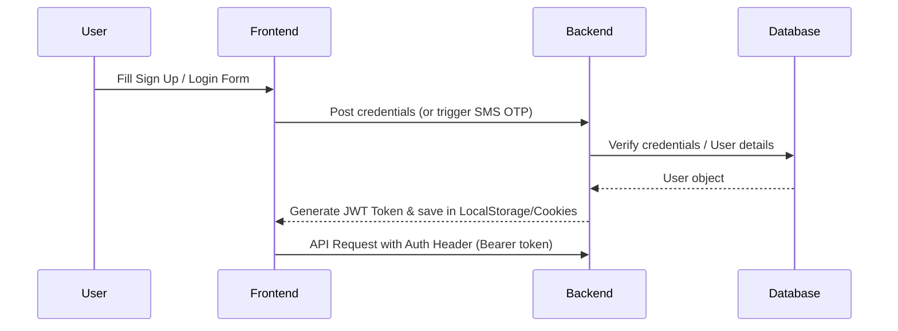
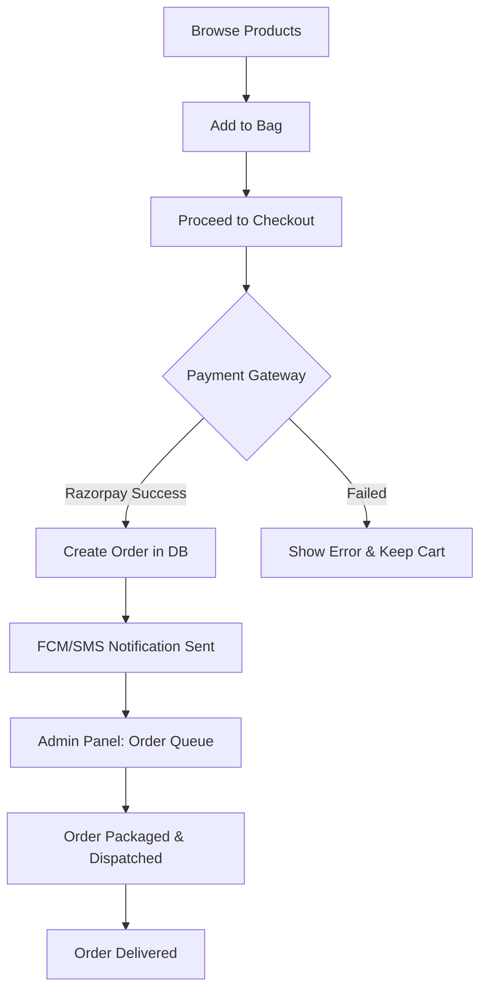

# Saundarya Shringar 🌸✨

Saundarya Shringar is a premium, full-featured Indian beauty and lifestyle e-commerce web application. Built with the MERN stack (MongoDB, Express, React, Node.js), it offers a seamless shopping experience for customers and a comprehensive administrative suite for managing business operations, products, finances, and orders.

---

## 🚀 Key Features

### 🛍️ User Experience (Frontend)
- **High-Fidelity UI**: Premium pastel pink/rose gold theme, curated typography, and fluid micro-interactions.
- **Dynamic Banners & Carousels**: Interactive hero banners highlighting promotions and trending categories.
- **Interactive Catalogue**: Advanced filtering, search, sorting, and price segmentation for effortless product discovery.
- **Shopping Bag & Wishlist**: Real-time cart calculations, slide-out drawer, and wishlist management.
- **Seamless Checkout**: Address management, coupon/discount validation, and interactive checkout steps.
- **Payment Gateway**: Integration with Razorpay for secure payments.
- **Order Tracking & History**: Step-by-step real-time order lifecycle tracking, receipts/invoicing, and order cancellation.
- **Reviews & Ratings**: Customer feedback system with visual ratings and written reviews.
- **Help Desk (Support Ticket)**: Built-in contact form and customer ticketing system.
- **Authentication**: Secured user registration, login (JWT-based), and optional OTP verification via SMS.

### ⚙️ Administrative Suite (Admin Panel)
- **Interactive Dashboard**: Graphical statistics on sales, revenue, average order value, and registration trends.
- **Inventory & Catalog Management**: CRUD operations for products, categories, dynamic visibility controls, and stock levels.
- **Order Fulfillment & Logistics**: Admin workflow to process orders, assign delivery statuses, and generate invoices.
- **Promotions & Offers**: Create and manage coupons, discounts, seasonal offers, and marketing banners.
- **Review Moderation**: Monitor customer feedback, flag/approve reviews, and respond to inquiries.
- **Customer Support Desk**: Access user tickets, change ticket status, and resolve issues.
- **Finance & Analytics**: Detailed records of revenue, platform logistics, locations, and return rates.
- **CMS (Content Management System)**: Manage interactive blogs and promotional banners dynamically.

---

## 🛠️ Tech Stack & Integrations

| Layer | Technologies & Libraries |
|---|---|
| **Frontend** | React (Vite), Tailwind CSS, Context API, Axios, Lucide React, Framer Motion |
| **Backend** | Node.js, Express.js |
| **Database** | MongoDB Atlas, Mongoose (ODM) |
| **Authentication** | JSON Web Tokens (JWT), BcryptJS |
| **Storage (Images)**| Cloudinary Integration |
| **Payments** | Razorpay Node SDK |
| **SMS Gateway** | SMSIndiaHub (OTP SMS verification) |
| **Notifications** | Firebase Cloud Messaging (FCM Admin SDK for Push Notifications) |
| **Middleware** | Helmet (Security), Compression (Speed), Morgan (Logging), CORS |

---

## 📂 Codebase Architecture

```
Saundarya-Shringar-master/
├── backend/
│   ├── config/             # Database connection, Firebase configs
│   ├── controllers/        # Business logic (users, products, orders, etc.)
│   ├── middleware/         # Auth, validation, error handlers
│   ├── models/             # Mongoose Schemas (User, Product, Order, Review, Blog, etc.)
│   ├── routes/             # Express API endpoints
│   ├── utils/              # Notification, Cloudinary, Payment helpers
│   ├── server.js           # Server startup script
│   └── package.json        # Node.js backend dependencies
│
└── frontend/
    ├── public/             # Static public assets
    ├── src/
    │   ├── assets/         # App images, logos, styling assets
    │   ├── components/     # UI components
    │   │   ├── admin/      # Admin dashboard & management components
    │   │   └── user/       # Shop, product detail, checkout, support components
    │   ├── context/        # Global React Contexts (Auth, Cart, Wishlist, Theme)
    │   ├── data/           # Mock data and configuration details
    │   ├── utils/          # Frontend helper functions, API clients
    │   ├── App.jsx         # Main router and page setup
    │   └── main.jsx        # App entry point
    └── package.json        # Frontend React/Vite dependencies
```

---

## 🔄 Project & Data Flow

### 1. Authentication & Session Flow


### 2. Purchase & Fulfillment Lifecycle


---

## ⚙️ Local Development Setup

### Prerequisites
- Node.js installed (v18+ recommended)
- MongoDB Atlas cluster or a running local MongoDB instance
- Cloudinary credentials (for image uploads)
- Razorpay API key & secret

### 1. Clone the repository
```bash
git clone https://github.com/your-username/Saundarya-Shringar.git
cd Saundarya-Shringar
```

### 2. Configure Backend Env Settings
Create a `.env` file in the `backend/` directory:
```env
PORT=5001
MONGODB_URI=mongodb+srv://<username>:<password>@cluster.mongodb.net/saundarya-shringar
JWT_SECRET=your_jwt_secret_key
CLOUDINARY_CLOUD_NAME=your_cloudinary_cloud_name
CLOUDINARY_API_KEY=your_cloudinary_api_key
CLOUDINARY_API_SECRET=your_cloudinary_api_secret
RAZORPAY_KEY_ID=your_razorpay_key_id
RAZORPAY_KEY_SECRET=your_razorpay_key_secret
FRONTEND_URL=http://localhost:5173
SMSINDIAHUB_API_KEY=your_sms_key
SMSINDIAHUB_SENDER_ID=SMSHUB
USE_REAL_OTP=false
```

### 3. Configure Frontend Env Settings
Create a `.env` file in the `frontend/` directory:
```env
VITE_API_URL=http://localhost:5001/api
VITE_RAZORPAY_KEY_ID=your_razorpay_key_id
```

### 4. Install & Run

**Backend:**
```bash
cd backend
npm install
npm run dev
```

**Frontend:**
```bash
cd ../frontend
npm install
npm run dev
```

---

## 📄 License
This project is licensed under the ISC License. Created with ❤️ by the Saundarya Shringar team.
